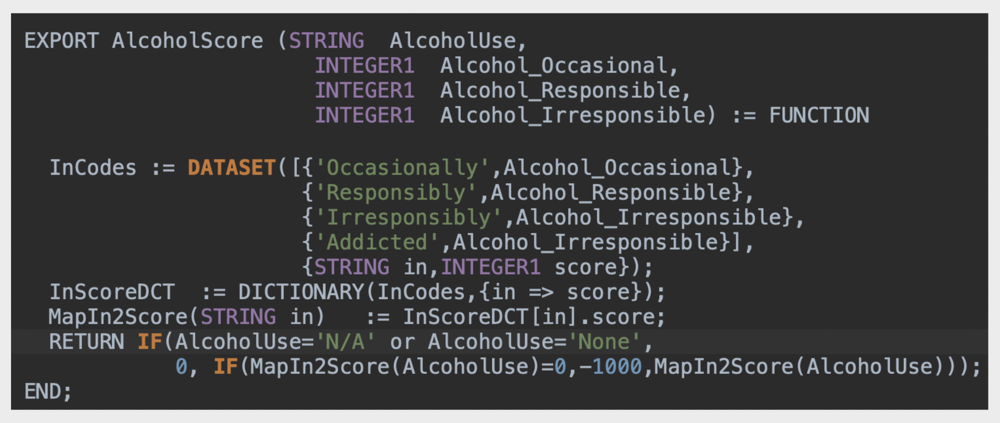
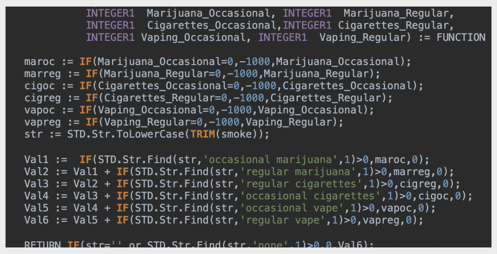
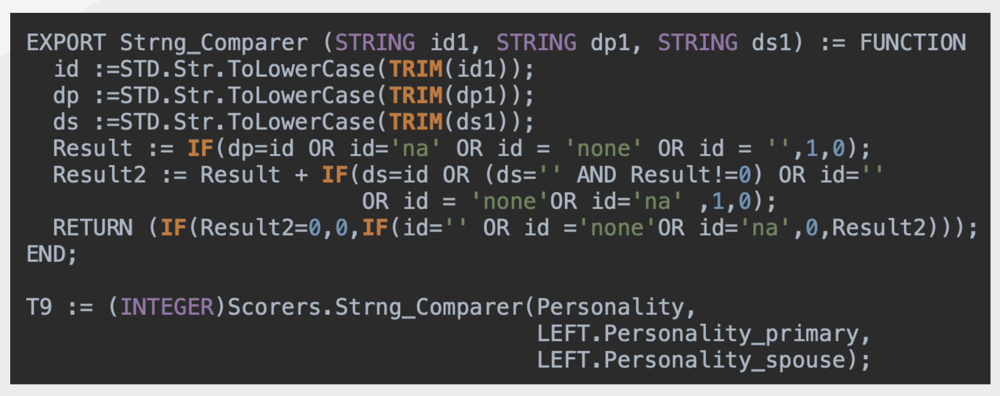
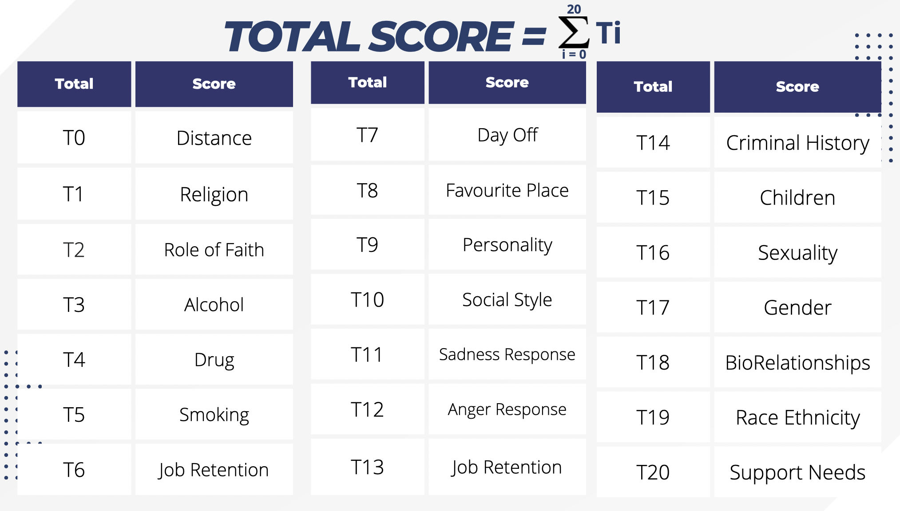
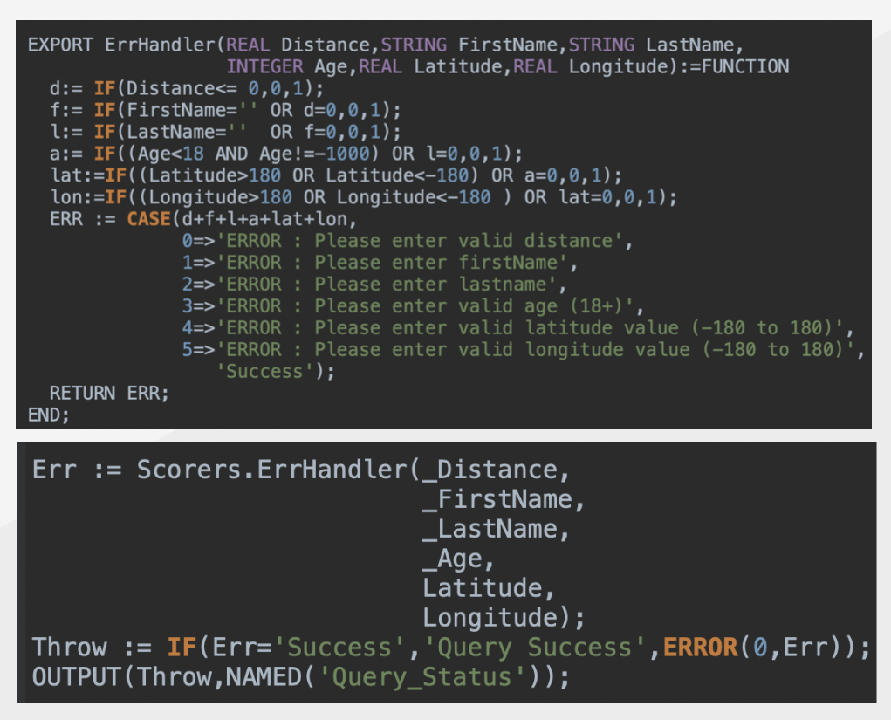
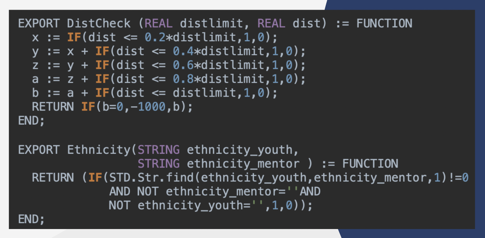
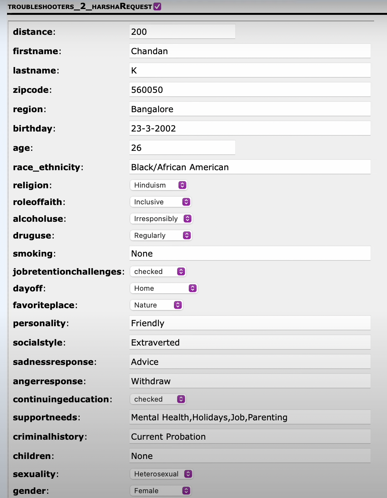
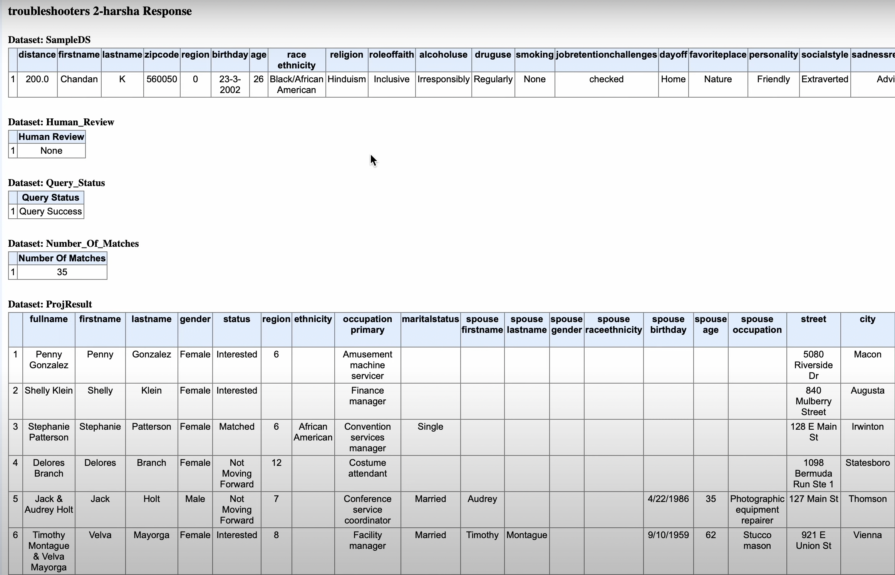
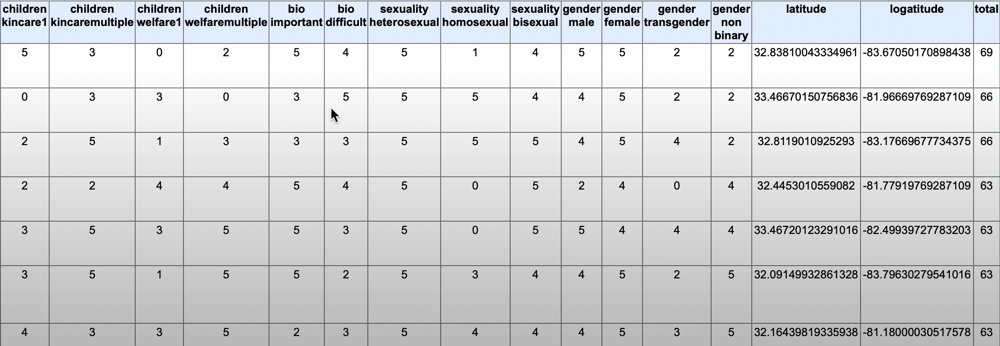
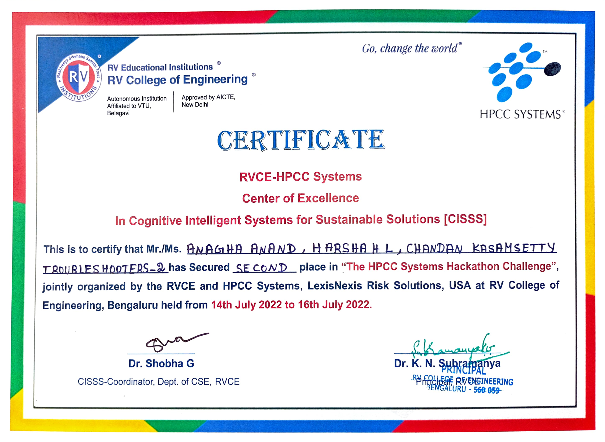

# HPCC Systems Hackathon

  ## Problem Statement
  
  Design a weighted mechanism to match (homeless / out of foster care) youth to mentoring families. 
  
1. Weights are provided on the scale of 0 to 5 with 5 being the maximum or most favouring. A number of fields act as parameters in matching a youth with their set of best mentors.

3. A score is to be calculated for each mentor by considering the input from youth and the weight for that field specified by the mentor. The mentor with the highest score is matched with the youth and a list of eligible mentors is to be displayed for that particular youth. 

5. In case a mentor has specified 0 weight for a particular field and the youth specifies it as a requirement, the mentor is to be eliminated. For example, if the gender specified by the youth is male but the weight for gender_male is 0 for a mentor, that mentor is considered ineligible to be matched with the youth irrespective of the mentor's score.

7. Another deciding factor is the distance that should be calculated from the latitude and longitude that is provided from the youth. Mentors should be eliminated incase the calculated distance exceeds that of the limit entered by youth. Mentors from same city as youth having distance 0 can be considered.
 
9. Also, if a youth doesn't provide information for a particular field (N/A), it should be verified and be placed under Human Review. A list of fields coming under human review is to be displayed when the youth submits the form. Any invalid inputs or no inputs to required fields must be handled by displaying an error message accordingly.

# Our team *Troubleshooters_2* 's solution

### [Video Demo](https://youtu.be/S4ZRp5gYPaU)
### [Presentation](https://www.canva.com/design/DAFGf9MS1LI/PFJqBWmPJ64xswSXol7iqg/view?utm_content=DAFGf9MS1LI&utm_campaign=designshare&utm_medium=link2&utm_source=sharebutton)

## Haversine formula


- determines the great-circle distance between two points on a sphere given their longitudes and latitudes.
- high accuracy of 99.5%.
- was used to calculate the distance between the youth and the mentor using their latitudes and longitudes.


## Score Calculation
### 1. One to multiple mapping
    Parameters -
    Religion, AlcoholUse, DrugUse, JobRetention, Continuing Education, SocialStyle, Sexuality, Gender, Biorelationships, Support Needs
- If weight of a field in mentoring family is 0 and youth has selected that attribute, the function returns -1000.
- Total score becomes negative, thereby eliminating the mentor.
- Mapping one parameter of youth to several fields in mentoring table using dictionaries.



### 2. String Manipulation
    Parameters -
    CriminalHistory, Smoking, Children
- For text field inputs, string handling functions from STD Library are incorporated. 
- To handle case sensitivity, we covert the text to lower case and trim the white space.
- The occurence of phrases are detected by using the predefined Find() function.



### 3. Primary - Spouse cases
    Parameters -
    RoleofFaith, DayOff, FavoritePlace, Personality, AngerResponse, SadnessResponse
- Best case: Exact match between both primary and spouse to the youth's parameter -> 2 points
- Average case : Exact match between either primary or spouse and the youth's parameter -> 1 point
- Worst case: No match obtained in both primary and spouse -> 0 points



The total score for each mentor is calculated as follows :



## Human Review


- If no option is selected for any of the youth parameters in the form, that category/field is placed under human review.
- The parameters under human review are listed as a single cell table in the roxie form once the query is run.


## Error Handling

Roxie form gives an error message when the user enters an incorrect value for input fields.


- Invalid entries are checked for fields like Distance,  Latitude, Longitude and Age.
- An error is thrown if:
  - Distance < 0 
  - -180>Lat, Long>180
  - Age < 18
 
- If multiple mandatory fields  are invalid, the error is thrown for the first invalid field. 


  
## Custom Additions

- As an attempt to further enhance the Mentor Score, weights for 2 other parameters have been considered.
- The distance calculated from Haversine Formula(d) is compared with the user entered value(D). IF:
  - d <= 20% of D -> 1 point
  - d <= 40% of D -> 2 point
  - d <= 60% of D -> 3 points
  - d <= 80% of D -> 4 point
  - d <= 100% of D -> 5 point
  - d > D -> mentor is eliminated
 
- In case the ethnicity of the mentor matches with that of the youth, 1 point is added to the score.


The above code snippets are defined as functions and exported in the ```Scorers.ecl``` and ```Scorers_2.ecl``` files.
Roxie form and the total score calculation is implemented in ```Roxieck.ecl```.

## Form
  The following images display the query form and the results showcasing the eligible mentors (for that particular user) from best to worst order in the  form of a table.
  The fields placed under Human Review are also displayed alongside the entered information of the user.
  






The above image displays the set of eligible mentors in most-to-least favourable order based on their total scores.

### Certificate

